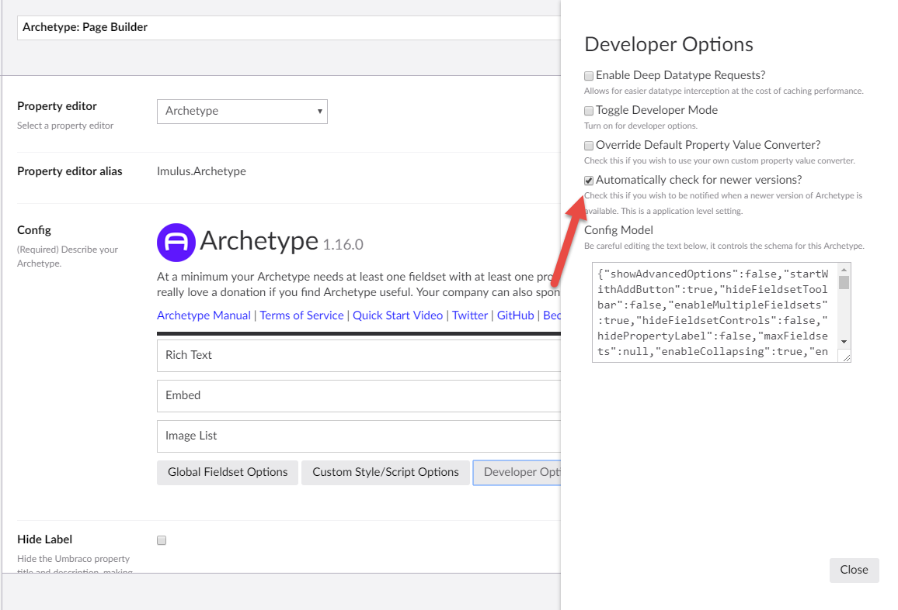

# Terms of Service

Archetype is provided as-is under the [MIT license](LICENSE).

As of version v1.16.0, we are checking your installed version of Archetype against the current version. In this process we collect the current version of Archetype along with the current version of Umbraco that you are running. We use these values to help determine a response message to you. You may opt-out of this process by 'un-checking' the option in any of the Archetypes you have configured in the `Developer->Data Types` section of Umbraco. 

This is a global setting that will set an `AppSetting` and cause your site to restart. We identify your install only by a randomly generated GUID. We WILL NOT store your IP address or hostname during the update check. You can 

Part of the reason we collect this information is to also ascertain how many active installs exist. If this number is sufficiently high, we can plan accordingly and attempt to keep this project going.

If you do not accept these Terms of Service in their entirety, please refrain from using Archetype in your Umbraco builds.

We would ask that you reach out to the Archetype team via creating an issue on this site if you have any questions or concerns. We truly want Archetype to be a win-win for all involved. 
